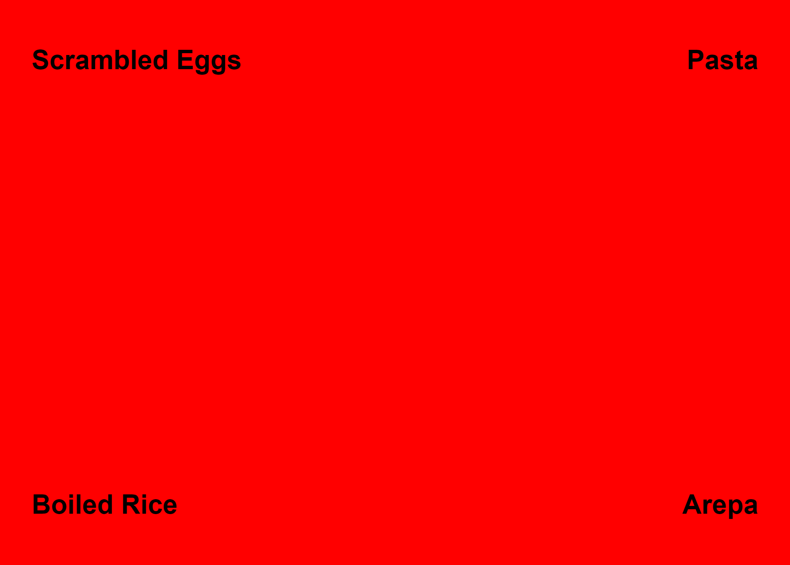
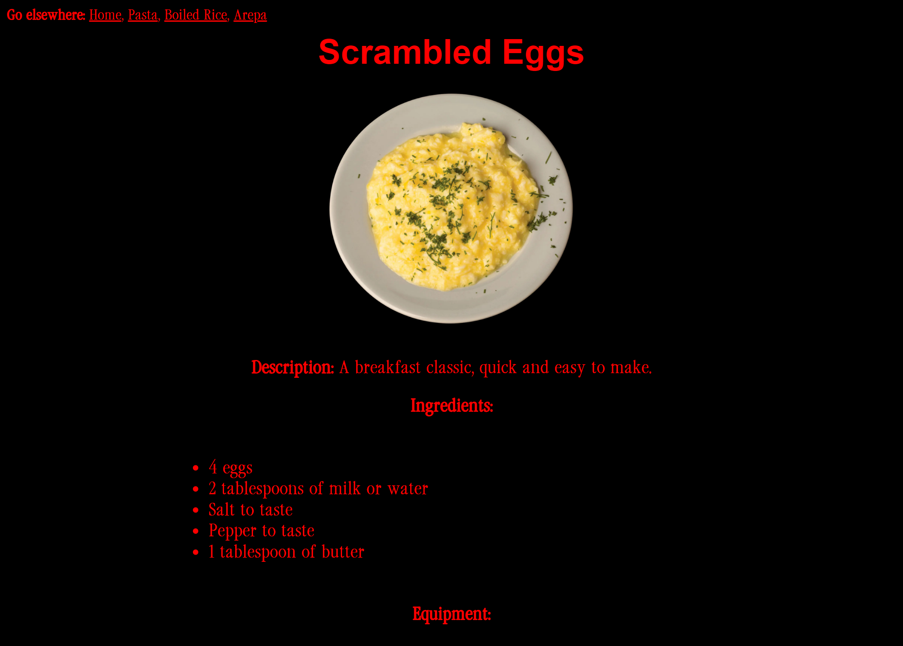
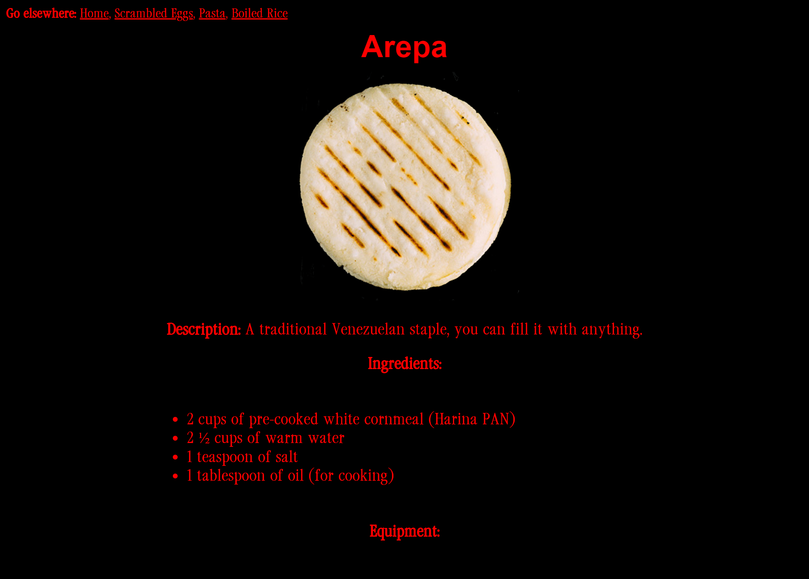

# Brutalist Cookbook
A collection of simple recipes for rather essential everyday meals you are too ashamed to ask how to make.

**Goal**

This website uses the foundational HTML and CSS skills outlined in The Odin Project curriculum. The goal is to create an accessible, aesthetically consistent, and easy-to-navigate user experience. HTML for a interconnected structure for the pages (every page links to every other page), and basic CSS for a cohesive 'brutalist' style.

**Screenshots**

**Inspo**
